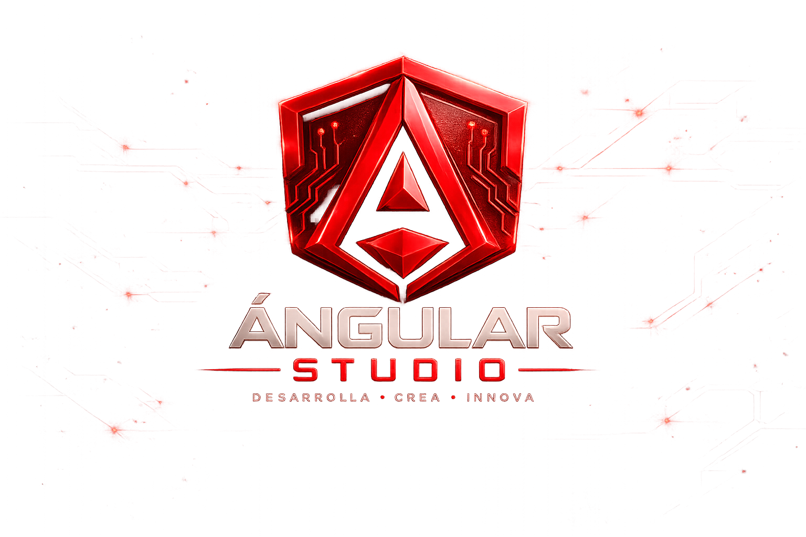

<<<<<<< HEAD
# AngularStudio

This project was generated using [Angular CLI](https://github.com/angular/angular-cli) version 21.2.11.

## Development server

To start a local development server, run:

```bash
ng serve
```

Once the server is running, open your browser and navigate to `http://localhost:4200/`. The application will automatically reload whenever you modify any of the source files.

## Code scaffolding

Angular CLI includes powerful code scaffolding tools. To generate a new component, run:

```bash
ng generate component component-name
```

For a complete list of available schematics (such as `components`, `directives`, or `pipes`), run:

```bash
ng generate --help
```

## Building

To build the project run:
=======
<div align="center">



# Angular Studio

### Development Workspace · Academic Edition

Aplicación web moderna desarrollada con **Angular 21**, creada originalmente durante el **Diplomado en Programación Web con Angular – MESCyT** y evolucionada como proyecto profesional de portafolio.

[](https://angular.dev/)
[](https://www.typescriptlang.org/)
[](https://firebase.google.com/)
[](#estado-del-proyecto)
[](#licencia)

</div>

---

## Descripción

**Angular Studio** es una plataforma de desarrollo, aprendizaje y demostración técnica construida con una arquitectura modular basada en componentes standalone.

El proyecto integra autenticación, consumo de APIs REST, herramientas para desarrolladores, gestión CRUD, preferencias de usuario y una Pokédex avanzada. Su propósito actual es demostrar competencias prácticas en ingeniería de software, desarrollo frontend moderno y despliegue en la nube.

## Demo

La aplicación está preparada para publicarse mediante Firebase Hosting:

**https://angular-studio-2b6c3.web.app**

> El enlace estará disponible después de completar el despliegue de Firebase Hosting.

## Tecnologías

<p align="center">
  
</p>

- Angular 21
- TypeScript
- Angular Signals
- RxJS
- SCSS
- Firebase Authentication
- Firebase Hosting
- REST APIs
- PokéAPI
- Node.js
- Sharp
- Git y GitHub

## Funcionalidades principales

- Dashboard con resumen de actividad y accesos rápidos.
- Autenticación mediante Firebase.
- Registro, inicio de sesión y recuperación de contraseña.
- API Playground para consumir servicios REST.
- Pokédex avanzada con regiones, formas, evoluciones, movimientos y encuentros.
- Gestión de favoritos, comparación y creación de equipos Pokémon.
- CRUD Lab para administrar registros.
- Herramientas para JSON, Base64, UUID y contraseñas seguras.
- Perfil de usuario y configuración de preferencias.
- Diseño responsivo para escritorio, tabletas y dispositivos móviles.
- Página académica con certificado y datos del proyecto.
- Lazy loading y protección de rutas mediante guards.

## Arquitectura

El proyecto utiliza una organización modular orientada a mantenibilidad y escalabilidad:

```text
src/app/
├── core/
│   ├── guards/
│   ├── services/
│   └── utils/
├── features/
│   ├── about/
│   ├── api-playground/
│   ├── auth/
│   ├── calculator/
│   ├── crud-lab/
│   ├── dashboard/
│   ├── developer-tools/
│   ├── home/
│   ├── profile/
│   └── settings/
├── layout/
├── shared/
└── app.routes.ts
```

### Principios aplicados

- Standalone Components
- Lazy Loading
- Route Guards
- Angular Signals
- Separación de responsabilidades
- Componentes reutilizables
- Servicios especializados
- Diseño responsivo
- Persistencia local
- Clean Code
- DRY y KISS

## Requisitos

- Node.js 22 LTS recomendado
- npm 10 o superior
- Angular CLI 21
- Cuenta y proyecto configurado en Firebase

## Instalación

```bash
git clone https://github.com/Jairo0811/AngularStudio.git
cd AngularStudio
npm install
ng serve
```

Abre en el navegador:

```text
http://localhost:4200
```

## Compilación para producción
>>>>>>> 627341e5aa8d11af091633812f04fcc461369aa0

```bash
ng build
```

<<<<<<< HEAD
This will compile your project and store the build artifacts in the `dist/` directory. By default, the production build optimizes your application for performance and speed.

## Running unit tests

To execute unit tests with the [Vitest](https://vitest.dev/) test runner, use the following command:

```bash
ng test
```

## Running end-to-end tests

For end-to-end (e2e) testing, run:

```bash
ng e2e
```

Angular CLI does not come with an end-to-end testing framework by default. You can choose one that suits your needs.

## Additional Resources

For more information on using the Angular CLI, including detailed command references, visit the [Angular CLI Overview and Command Reference](https://angular.dev/tools/cli) page.

## Angular Studio 2.0

La versión 2.0 incorpora:

- Pokédex avanzada con comparador, favoritos, filtros y equipos.
- CRUD Lab con persistencia local.
- Developer Tools: JSON Formatter, Base64, UUID y generador de contraseñas.
- Perfil de usuario y configuración de tema.
- Conversión automática de carátulas JPG/PNG a WebP.
- Dashboard con métricas reales.
- Flujo CI con GitHub Actions.

### Scripts principales

```bash
npm install
npm start
npm run build
npm test -- --watch=false
npm run convert:covers
```
=======
La salida de producción se genera en:

```text
dist/AngularStudio/browser
```

## Despliegue en Firebase Hosting

El archivo `firebase.json` debe apuntar al build de Angular:

```json
{
  "hosting": {
    "public": "dist/AngularStudio/browser",
    "ignore": [
      "firebase.json",
      "**/.*",
      "**/node_modules/**"
    ],
    "rewrites": [
      {
        "source": "**",
        "destination": "/index.html"
      }
    ]
  }
}
```

Compila y publica:

```bash
ng build
firebase deploy --only hosting
```

## Contexto académico

| Dato | Información |
|---|---|
| Participante | Francis Jairo Matías Rosario |
| Matrícula | 2015-2984 |
| Diplomado | Programación Web con Angular |
| Programa | BecaSoft |
| Período académico | 2020-T2 |
| Docente | Pedro Joaquín Sosa Abreu |
| Institución | Instituto Tecnológico de Las Américas (ITLA) |
| Entidades vinculadas | MESCyT y República Digital |
| Fecha del certificado | 8 de septiembre de 2020 |

Angular Studio comenzó como proyecto académico y fue reconstruido y ampliado hasta convertirse en una aplicación moderna de portafolio.

## Estado del proyecto

**Versión:** 2.0.0  
**Estado:** Estable  
**Edición:** Academic Edition

El proyecto se encuentra funcional y preparado para despliegue en Firebase Hosting.

## Próximas mejoras

- Optimización adicional de estilos y presupuestos de compilación.
- Pruebas unitarias y de integración.
- Automatización de CI/CD con GitHub Actions.
- Mejoras de accesibilidad.
- Métricas y monitoreo del frontend.

## Autor

**Francis Jairo Matías Rosario**  
Tecnólogo en Desarrollo de Software · Estudiante de Ingeniería de Software

- GitHub: [@Jairo0811](https://github.com/Jairo0811)
- Portafolio académico y profesional

## Licencia

Proyecto desarrollado con fines académicos, educativos y de portafolio profesional.

---

<div align="center">

**Angular Studio v2.0**  
Del aprendizaje académico a una aplicación profesional.

</div>
>>>>>>> 627341e5aa8d11af091633812f04fcc461369aa0
